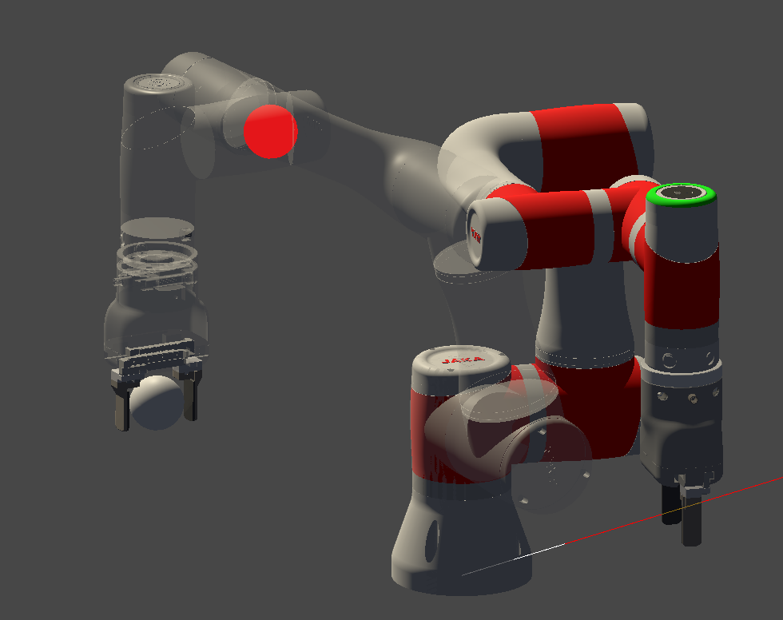

# IK Path Planning


# IK Solver

用于将关键点数据转化为关节动作（各关节旋转角度）

希望机械臂的末端始终竖直。方便夹取。

Unity IK: [https://github.com/2000222/Robotic-Arm-IK-in-Unity](https://github.com/2000222/Robotic-Arm-IK-in-Unity)

自定义自由度，非常好用，基于关节梯度迭代的方法

由这个 IK 算法负责机械臂前三个 joint 的旋转，确保 j4 的 anchor（红点）处于物体后上方的特定位置。


j4 位置的计算方法：

```csharp
public Vector3 GetPositionForJ4(Vector3 pos)
    {
        Vector3 forward = pos - Joints[0].transform.position;
        forward.y = 0;
        float angle = Mathf.Acos(0.1148f / forward.magnitude);
        Vector3 left = Quaternion.AngleAxis(-angle * 180f/Mathf.PI, Vector3.up) * forward;
        left = left.normalized * 0.1148f;
        Vector3 offset = forward - left;
        offset = offset.normalized * 0.1175f;
        return pos + Vector3.up * 0.2446f - offset;
    }
```

之后由向量计算得出 j4 应该旋转的角度，以确保末端竖直。



j5 不旋转，j6 的旋转角度由物体朝向决定。

# Router

## Route

一条路径由若干个关键点构成，在构建路径时只需输入若干 turning point，就会自行生成路径中的关键点。

```csharp
public class KeyPoint
{
    public Vector3 pos = Vector3.zero;
    public bool grab = false;
    public bool wait = false;
    public KeyPoint(Vector3 pos, bool grab = false, bool wait = false)
    {
        this.pos = pos;
        this.grab = grab;
        this.wait = wait;
    }
}

public class Route
{
    public List<KeyPoint> routes = new List<KeyPoint>();
    public Route(List<KeyPoint> turningPoints)
    {
        if (turningPoints.Count < 2)
        {
            return;
        }
        for (int i = 1; i < turningPoints.Count; i++)
        {
            KeyPoint start = turningPoints[i-1];
            KeyPoint end = turningPoints[i];
            float dist = (start.pos - end.pos).magnitude;
            int sigment = (int)(dist * 20f);
            for (int j = 0; j <= sigment; j++)
            {
                routes.Add(new KeyPoint(start.pos + ((float)j) / sigment * (end.pos - start.pos), start.grab));
            }
        }
    }
}
```

IK 只需要获取关键点的坐标信息就可以生成各个关节旋转的数据。

```csharp
InverseKinematics(GetPositionForJ4(position));
```
