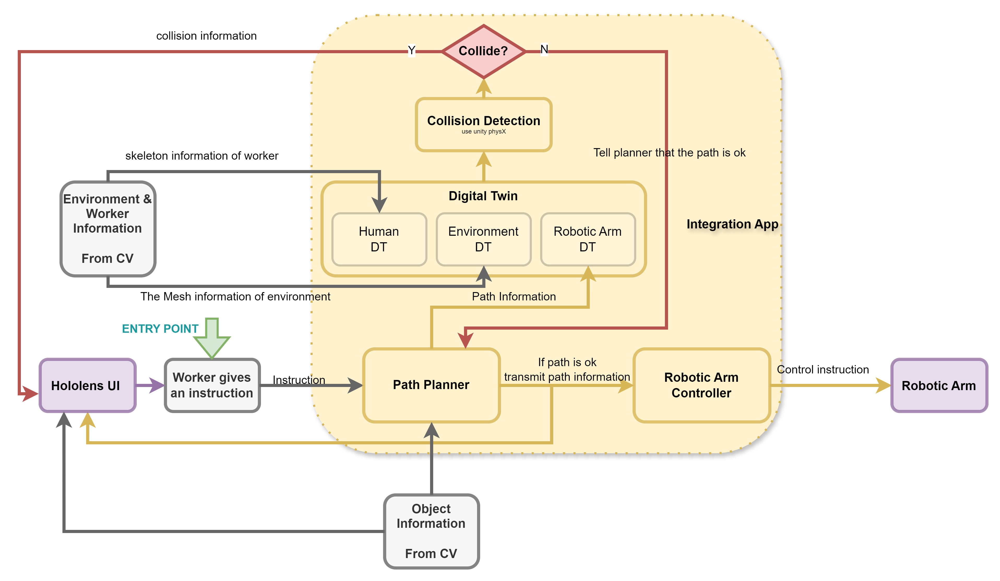

# 项目框架

以下为项目布局示意图

（左下角为深度相机）

以下为项目的架构图

具体解释一下这张图

- 首先用户佩戴 hololens，hololens 会先把可交互的物体（物体数据源于物体检测算法）渲染在 UI 上，之后用户基于这些视觉信息，给出交互指令。
- 随后系统会根据给到的指令和可交互物体的信息，规划机械臂的运动路径。
- 路径信息会首先传到数字孪生系统中。该系统中有三部分孪生，分别是人体（实时数据来自人体检测算法），环境（实时数据来自 hololens 的环境感知系统） 和 机械臂（来自于前面提到的路径信息）的孪生。
- 随后该 DT 系统会根据路径信息解算在机械臂运动过程中是否会发生碰撞。

  - 如果发生碰撞
    - 会把碰撞发生的位发还给 hololens 显示，用户可以选择取消指令或者选择移走遮挡的物体（）。
  - 如果不发生碰撞
    - 会把机械臂的预计运动轨迹发回给 hololens 显示，用于警戒用户。
    - 将运动轨迹发给机械臂控制器，控制器控制机械臂运动。
